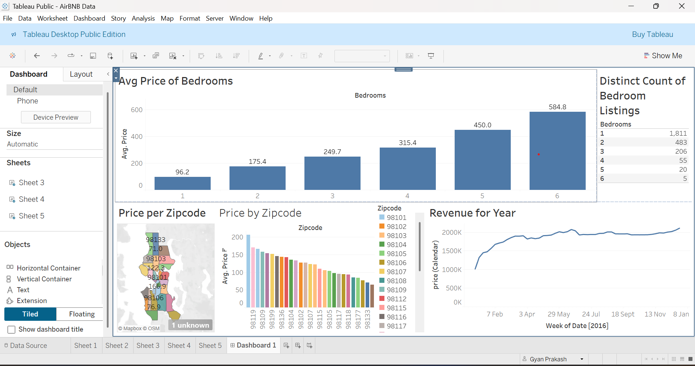

# Airbnb-analysis
# 📊 Tableau Dashboard: Airbnb Listings Analysis – Seattle, WA

This project is a **Tableau Public dashboard** that visualizes Airbnb listing data in Seattle by zip code, bedroom count, and time. The dashboard highlights pricing trends, listing counts, and revenue distribution across different areas and periods.

## 🖼️ Dashboard Preview

## 🚀 Project Highlights

- **Avg Price of Bedrooms**  
  Displays the average listing price based on number of bedrooms, showing how pricing scales with room count.

- **Price per Zip Code (Map & Bar Chart)**  
  A map and accompanying bar chart showing how average prices vary across Seattle’s zip codes.

- **Revenue Over Time**  
  A time-series line chart showing total revenue trends over the year.

- **Distinct Bedroom Counts**  
  A summary table showing how many listings exist for each bedroom count.

## 📍 Dataset

The dataset contains information about Airbnb listings in Seattle including:
- Zip Code
- Bedroom count
- Price
- Calendar-based revenue
- Geolocation (inferred from Zip Code)

## Tools Used

- [Tableau Public]
- Data visualization techniques (map charts, bar graphs, line charts)
- Geo-mapping with zip code dimensions
- Dashboard layout containers and filters

## 📈 Insights Gained

- Listings with more bedrooms tend to command significantly higher prices.
- Zip codes like **98119**, **98109**, and **98103** show higher average prices.
- Revenue grows steadily throughout the year, peaking in summer months.

## 🔗 View Live Dashboard

> **🔍 Tableau Public Link:** [View Dashboard](https://public.tableau.com/views/AirBNBData_17459260778380/Dashboard1?:language=en-US&:sid=&:redirect=auth&:display_count=n&:origin=viz_share_link)
